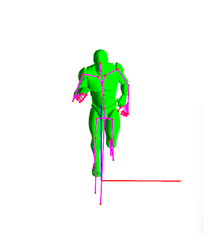
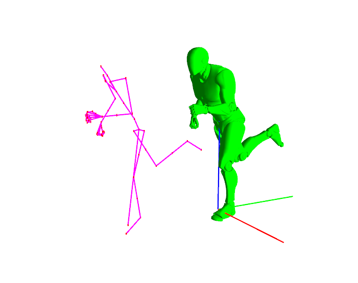
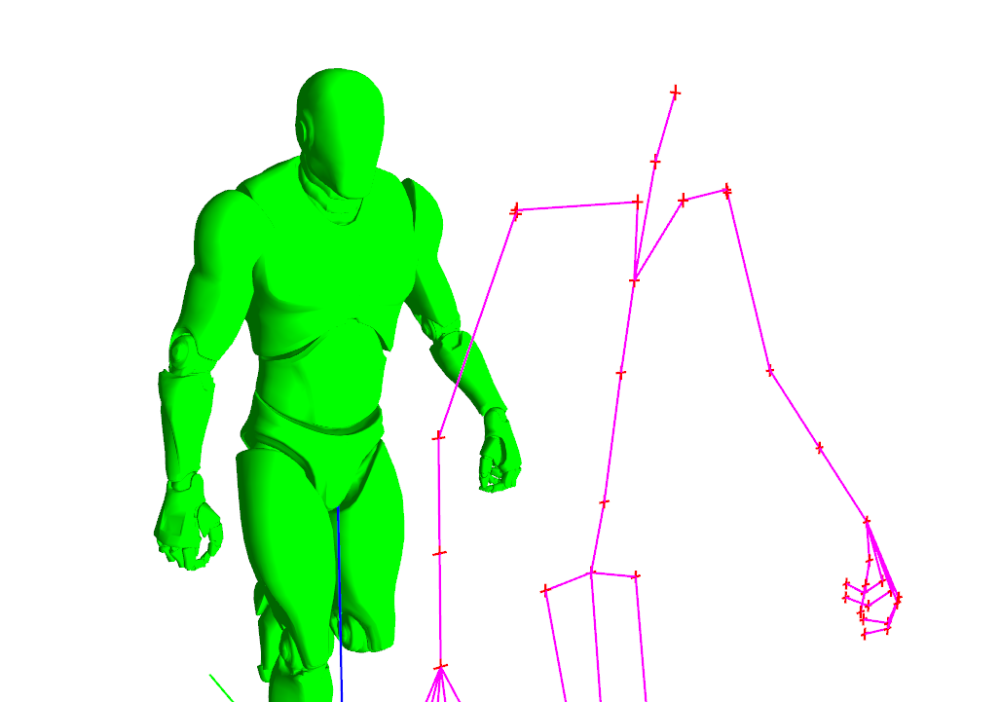
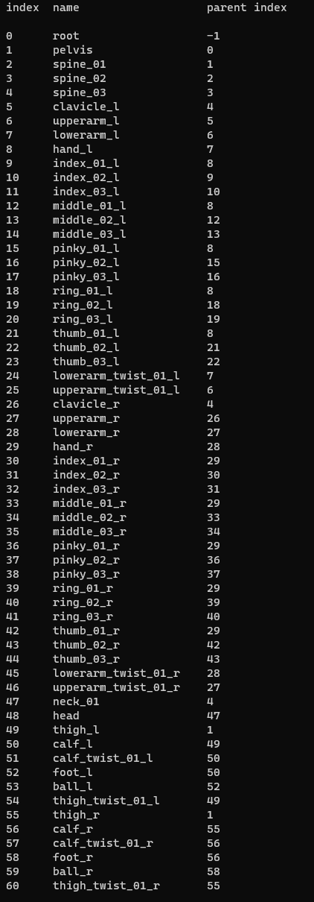

# Animation Programming

### Overview

This small project aims to introduce us to animation programming. In this project, a skeletal mesh is loaded as well as a file containing bones and another containing animations. The goal of the project was to set all the bones correct positions using matrices, bind them to the mesh, and animate the whole thing.

### Features

Move around with WASD.
Rotate the camera with the mouse.
Press :
- 1 for run animation
- 2 for walk animation
- 3 for pause/play

### Misc

On Launch, you can see the bones of the mesh in the stick figure. The bones are all the red crosses which are all linked by the pink lines.

Sometimes on launch, the project doesn't properly generate the skeletal mesh. Just relaunch the project until everything is loaded.

### Screenshots

Here you can see the list of bones and their parents :
(note : parent index -1 means no parent)

